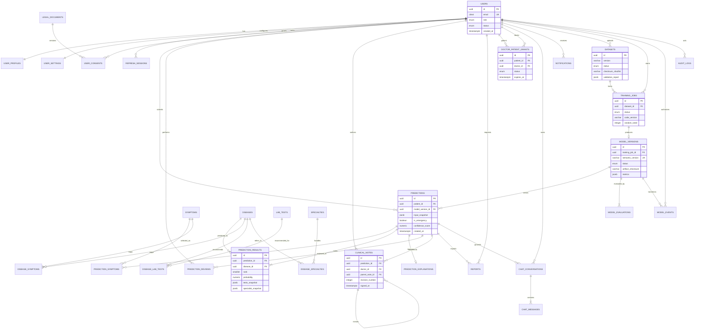

# 4. ER Diagram

The diagram focuses on domain relationships. Operational columns and some join-table attributes are documented in the database design.

## Relationship notes

- `USERS` plays different roles; database constraints plus application authorization validate patient/doctor/admin role compatibility.
- Prediction result snapshots deliberately coexist with foreign keys. Foreign keys enable analytics; snapshots guarantee historical rendering if catalog text changes.
- A training job produces at most one promoted model bundle. Failed experiments remain training records without a model version.
- Doctor access is explicit through grants. A role alone is insufficient to read patient data.
