# MediAI Pro — Complete System Architecture

| Document property | Value |
|---|---|
| Document ID | MAP-ARCH-001 |
| Version | 1.0 |
| Status | Proposed — awaiting approval |
| Date | 2026-07-26 |
| Related specification | MAP-SRS-001 |
| Architecture style | Modular monolith with clean domain boundaries and asynchronous workers |

This document defines the production architecture for MediAI Pro. It contains no implementation code. It consolidates the existing approved design direction without modifying the SRS or earlier architecture documents.

## 1. Architecture goals and principles

### 1.1 Goals

- Keep deterministic disease prediction independent from generative AI.
- Make every prediction reproducible from immutable inputs, model, rules, and clinical mappings.
- Protect patient information with explicit ownership, consent, grants, least privilege, and auditability.
- Support patient, doctor, and administrator experiences without duplicating business logic.
- Scale the API, worker, model, and frontend independently within the selected deployment platforms.
- Degrade safely when the LLM, email, report generation, object storage, or inference model is unavailable.
- Keep the initial system operationally simple while retaining boundaries that permit later service extraction.

### 1.2 Governing principles

- **Clean Architecture:** domain rules are independent of React, FastAPI, SQLAlchemy, storage, ML, LLM, and deployment vendors.
- **SOLID:** small responsibilities, extension through adapters, substitutable providers, narrow ports, and dependency inversion.
- **Feature-Based Architecture:** frontend and backend ownership is organized around business capabilities rather than framework file types.
- **Defense in depth:** controls exist at browser, edge, API, application, database, storage, provider, and operational layers.
- **Fail closed for authorization; fail safe for clinical behavior:** uncertain permission denies access; dependency failure never fabricates clinical output.
- **Immutable history:** predictions, signed notes, consent versions, model events, and artifacts remain reconstructable.
- **Asynchronous boundaries:** long-running or externally dependent work is removed from interactive request latency.
- **Contract first:** OpenAPI, model feature schemas, artifact metadata, and event payloads are versioned contracts.
- **Observability by design:** correlation IDs connect browser activity, API requests, jobs, provider calls, and audit events.

### 1.3 Key architecture decisions

| Decision | Choice | Reason |
|---|---|---|
| Application topology | Modular monolith plus worker | Preserves transaction simplicity while enforcing domain boundaries |
| Frontend delivery | React SPA on Vercel CDN | Fast static delivery, preview deployments, independent release |
| API | Versioned REST over HTTPS | Stable resource semantics and generated OpenAPI contracts |
| Chat streaming | Server-Sent Events | One-way token streaming without WebSocket complexity |
| Persistence | Supabase PostgreSQL | Relational integrity, transactional lifecycle state, managed backups |
| Binary storage | Private object storage | Keeps datasets, models, reports, and exports out of relational rows |
| Auth | Short-lived access JWT plus rotating refresh cookie | Stateless API access with revocable session families |
| Core prediction | Versioned calibrated ML bundle | Reproducible probabilities independent of the LLM |
| Emergency detection | Deterministic versioned rule engine | Reviewable safety behavior available during model/LLM failure |
| LLM | Grounded asynchronous explanation and chat only | Prevents generative output from becoming the prediction source |
| Background processing | Dedicated Railway worker using durable database jobs/outbox | Survives web restarts and prevents long request blocking |
| Model promotion | Explicit evaluation, approval, activation, rollback | Prevents unreviewed experiments from serving users |

## 2. High-Level Architecture

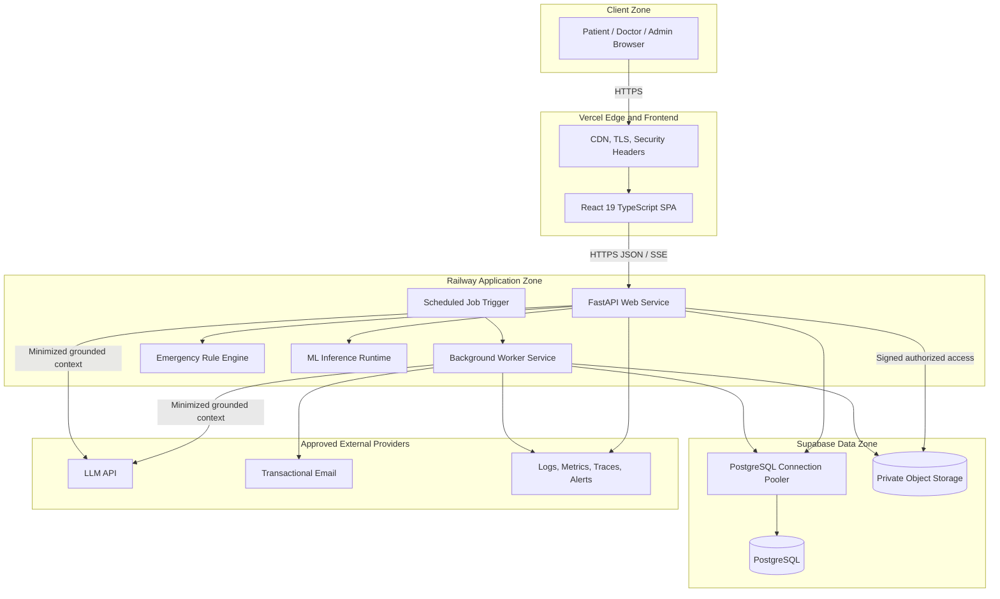

### 2.1 Runtime responsibilities

| Component | Responsibility | Must not do |
|---|---|---|
| React SPA | Routing, accessible presentation, forms, server-state orchestration, streaming UI | Enforce final authorization or calculate clinical predictions |
| FastAPI service | HTTP contracts, auth, authorization, use-case orchestration, transactions, inference coordination | Train models inside requests or trust client-supplied roles/results |
| Worker | Explanations, reports, notifications, exports, dataset validation, training, scheduled cleanup | Serve interactive browser traffic |
| Rule engine | Evaluate versioned emergency rules deterministically | Depend on LLM availability |
| Inference runtime | Validate feature schema and run verified active model bundle | Load user-supplied Joblib or generate explanatory prose |
| PostgreSQL | Durable relational state, constraints, job/outbox state, audit records | Store large model/dataset/report binaries |
| Private storage | Datasets, model bundles, reports, exports, safe job logs | Expose public buckets or unauthenticated permanent URLs |
| LLM provider | Generate grounded explanation/chat text | Calculate or modify probabilities, severity, tests, specialists, or emergency state |
| Monitoring | Receive redacted telemetry and alerts | Receive raw secrets or unnecessary clinical content |

### 2.2 Trust boundaries

1. Browser to Vercel edge: all client inputs are untrusted.
2. Vercel frontend to Railway API: HTTPS API boundary; frontend permissions are advisory only.
3. API/worker to PostgreSQL: separate least-privilege service identities.
4. API/worker to private storage: scoped credentials and signed-object access.
5. Platform to LLM/email/monitoring vendors: minimum-necessary outbound data.
6. Dataset upload to quarantine: untrusted file boundary.
7. Quarantine to training eligibility: validation and governance boundary.
8. Candidate model to active model: evaluation, approval, artifact verification, and activation boundary.

## 3. Frontend Architecture

### 3.1 Layer model

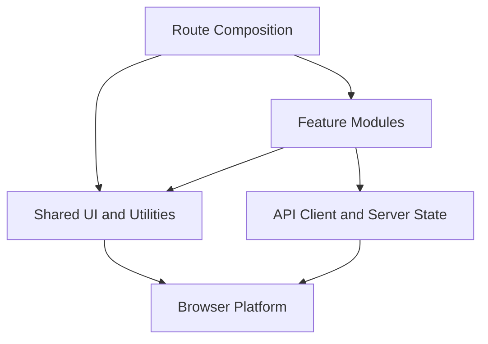

Dependencies point downward. Shared modules never import a feature. Features expose intentional public entry points and must not use deep imports into another feature.

### 3.2 Application shell

- `App` composes error boundary, query client, authentication, theme, reduced-motion, toast, tooltip, and router providers.
- Public, authentication, patient, doctor, and admin layouts own navigation appropriate to their context.
- Authentication guards establish identity; role guards improve navigation UX. The API rechecks authorization.
- Route-level error boundaries isolate failed features and preserve navigation.
- Lazy route chunks reduce initial bundle size; core safety and authentication UI remains immediately available.

### 3.3 Feature modules

| Feature | Responsibilities |
|---|---|
| `landing` | Public product, safety, privacy, FAQ, and conversion content |
| `auth` | Registration, verification, login, MFA, password recovery, sessions |
| `dashboard` | Patient statistics, summaries, trends, and recent activity |
| `predictions` | Symptom assessment, input review, submission, results, emergency UI |
| `history` | Filtering, pagination, detail, archive, reports |
| `chat` | Conversations, SSE streaming, grounding state, safety responses |
| `doctor` | Granted patients, review queue, notes, revisions, clinical reports |
| `admin` | Users, catalogs, datasets, training, model registry, audit, analytics |
| `profile` | Identity and optional clinical-profile management |
| `settings` | Theme, motion, locale, timezone, notifications, privacy operations |
| `notifications` | Notification center, unread state, action navigation |

Each feature owns its pages, components, Zod schemas, typed service functions, TanStack Query definitions, and feature types. Only reusable, domain-neutral elements move to shared modules.

### 3.4 State ownership

| State type | Owner |
|---|---|
| Remote resources and mutations | TanStack Query |
| Form input and validation feedback | React Hook Form with Zod |
| Shareable filters, period, sort, and cursor | URL search parameters |
| Identity/session presentation | Auth provider backed by query cache |
| Theme and reduced-motion preference | Narrow providers |
| Ephemeral component state | Local React state |
| Streamed message under construction | Chat feature state, committed to query cache on completion |

A general global store is not introduced without a proven cross-feature state requirement.

### 3.5 API boundary

- One configured Axios client applies base URL, request ID, access token, timeout, cancellation, and normalized Problem Details errors.
- Refresh is coordinated so multiple simultaneous `401` responses cause one refresh attempt, then replay safe requests once.
- Mutations that may be retried use a client-generated idempotency key.
- OpenAPI-generated TypeScript contracts are used at the transport boundary.
- Domain-facing view models translate transport shapes into display-safe types when useful.
- Query keys are defined per feature and use stable factories.
- Sensitive information is not persisted to local storage. Access-token handling follows the final approved browser-security policy.

### 3.6 Forms and validation

- Zod provides immediate client feedback and mirrors documented constraints.
- Server validation is authoritative and returns stable field codes.
- Multi-step prediction state validates each step and validates the complete payload before submission.
- A review screen shows all clinically relevant input before the user acknowledges informed use.
- Form errors are associated with fields, summarized, announced to assistive technology, and focus the first invalid control.

### 3.7 UI system and accessibility

- Shadcn UI primitives are composed into application-owned reusable components; clinical meaning is never coupled to a library's default colors.
- Tailwind design tokens define medical blue/cyan surfaces, semantic severity, spacing, typography, elevation, and dark mode.
- Glassmorphism remains decorative; reading surfaces preserve WCAG 2.2 AA contrast.
- Framer Motion provides purposeful transitions and respects `prefers-reduced-motion`.
- Recharts views include text summaries and accessible tabular alternatives.
- Emergency information precedes charts and animations, uses text/icons in addition to color, and remains keyboard/screen-reader accessible.

### 3.8 Frontend resilience

- Every query surface implements loading, empty, partial failure, permission denied, offline/retry, and unexpected error states.
- Prediction completion is not inferred from client timeouts; the client resolves the persisted server resource by ID.
- Chat streams can stop, reconnect, or resolve final message state without duplicating messages.
- Report generation displays durable job state instead of holding a request open.
- Error telemetry is redacted and correlated without sending clinical form contents.

## 4. Backend Architecture

### 4.1 Clean Architecture layers

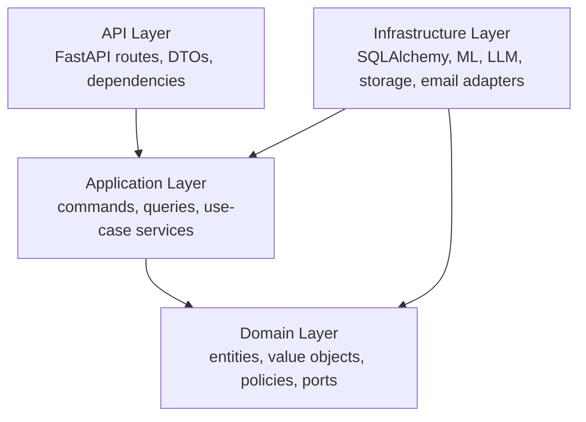

The domain does not import outer layers. Application services depend on domain ports. Infrastructure implements those ports. FastAPI routes translate HTTP to application commands and translate results to explicit Pydantic response models.

### 4.2 Domain modules

| Module | Owned behavior |
|---|---|
| `auth` | Credentials, session families, verification, reset, MFA, step-up |
| `users` | Identity, profile, settings, account state, privacy requests |
| `clinical_catalog` | Symptoms, diseases, severity, tests, specialties, mappings, rules |
| `predictions` | Assessment validation, emergency orchestration, ranking, snapshots |
| `reports` | Report request lifecycle and authorized delivery |
| `chat` | Conversation ownership, message lifecycle, grounding and safety metadata |
| `doctor` | Grants, reviews, signed notes, note revisions |
| `admin` | Privileged user/catalog/model workflows and analytics |
| `notifications` | In-app and transactional delivery policies |
| `audit` | Append-only security/business events |
| `ml` | Dataset, training job, model registry, evaluation, promotion |

Modules communicate through application contracts or domain events. They do not directly mutate another module's tables through leaked ORM models.

### 4.3 Request lifecycle

1. Edge and API middleware apply request size, CORS, host, security, and rate-limit policies.
2. Request-ID middleware validates or assigns a correlation ID.
3. Authentication resolves the access-token subject and session/security state.
4. Authorization dependencies evaluate role, permission, ownership, grant scope, and step-up age.
5. Pydantic validates and normalizes the transport request with unknown fields rejected.
6. The route invokes one application command/query.
7. The application service enforces domain rules and coordinates repositories/adapters.
8. Transaction boundaries commit business state plus outbox/audit intent atomically.
9. The API maps domain errors to RFC 9457 Problem Details.
10. Structured redacted telemetry records latency, outcome, and correlation.

### 4.4 Persistence and transaction strategy

- SQLAlchemy 2.x repositories implement domain repository ports.
- ORM entities remain infrastructure details and never become API schemas.
- Application use cases own transaction boundaries through a unit-of-work abstraction.
- Prediction creation atomically stores assessment, results, version snapshots, audit intent, and explanation outbox event.
- Optimistic concurrency protects mutable catalog and account administration.
- Database uniqueness/foreign keys/check constraints protect invariants even under concurrent requests.
- Idempotency records bind user, operation scope, key hash, and request hash to a durable response.

### 4.5 Background jobs and outbox

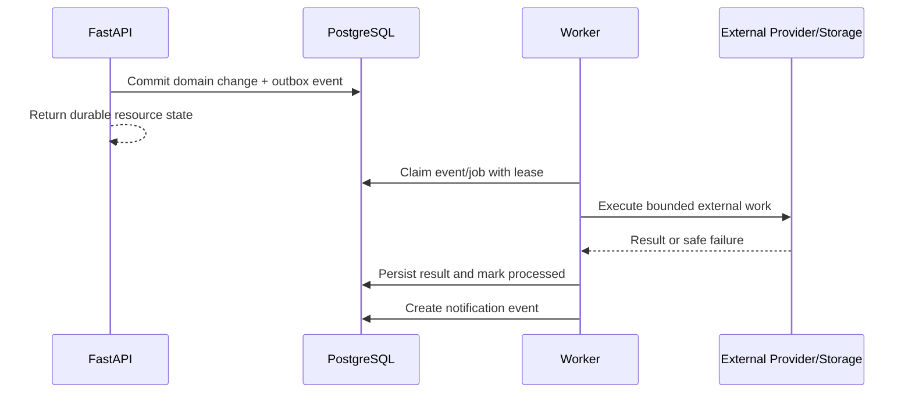

- PostgreSQL is the initial durable job/outbox authority, avoiding an unrequested extra broker.
- Workers claim work using transactional row locking, leases, attempt counters, and exponential backoff with jitter.
- Jobs are idempotent and distinguish retryable from permanent failures.
- Repeated failures enter an inspectable terminal/dead-letter state.
- Training jobs run in a separately sized worker process from lightweight explanation/report tasks when resource contention requires it.

### 4.6 Error model

- Domain exceptions have stable semantic codes.
- Transport errors use Problem Details with status, type, title, safe detail, request ID, and optional field errors.
- Internal stack traces, SQL details, provider payloads, tokens, and sensitive clinical content are never exposed.
- Timeouts and circuit breakers isolate LLM, email, storage, and monitoring dependencies.
- The API never converts an inference failure into a low-probability disease response.

## 5. Machine Learning Architecture

### 5.1 Training architecture

```mermaid
flowchart LR
    Upload["Admin Upload"] --> Quarantine["Private Quarantine Storage"]
    Quarantine --> Validate["Schema, Provenance, Quality, Safety Validation"]
    Validate -->|Invalid| Reject["Quarantined / Rejected"]
    Validate -->|Valid| Dataset["Immutable Dataset Version"]
    Dataset --> Split["Grouped Stratified Split"]
    Split --> Preprocess["Fitted Preprocessing Pipeline"]
    Preprocess --> Train["Baseline and XGBoost Candidates"]
    Train --> Calibrate["Probability Calibration"]
    Calibrate --> Evaluate["Top-k, Macro, Per-Class, Subgroup, OOD, Latency"]
    Evaluate -->|Fails gates| RejectedModel["Rejected Candidate"]
    Evaluate -->|Passes gates| Bundle["Signed/Checksummed Model Bundle"]
    Bundle --> Review["Independent Approval"]
    Review -->|Approved| Registry["Approved Model Registry"]
    Registry --> Activate["Atomic Activation"]
    Activate --> Serve["Verified Warm Inference Runtime"]
```

### 5.2 Dataset boundary

- Uploads enter private quarantine and are not directly readable by training code as executable artifacts.
- Validation requires provenance, license, intended population, supported labels, source period, schema version, checksum, and de-identification statement.
- Content checks cover unknown labels, ranges, units, missingness, duplicates, class balance, subgroup coverage, leakage indicators, and unapproved free text.
- Only an immutable `VALID` dataset version can start training.
- Development and CI use synthetic or explicitly approved de-identified data.

### 5.3 Training and evaluation

- A scikit-learn `Pipeline`/`ColumnTransformer` conceptually binds feature transformation to the fitted model so training and inference use the same ordering and missingness rules.
- Candidates include an interpretable multinomial logistic baseline and selected nonlinear models, with XGBoost as the primary high-capacity candidate.
- Patient/source grouping prevents the same subject leaking across partitions when identifiers exist.
- Hyperparameter selection uses only training/validation data; the final test set remains untouched until candidate evaluation.
- Recorded metadata includes dataset checksum, code revision, library versions, feature/label schemas, algorithm, parameters, random seed, and timing.
- Mandatory evaluation covers macro F1, balanced accuracy, top-1/top-3/top-5 accuracy, log loss, Brier score, expected calibration error, per-class recall/precision, subgroup metrics, latency, memory, and artifact size.

### 5.4 Model bundle and registry

An immutable bundle contains preprocessing, classifier, calibrator, ordered feature schema, label map, confidence/OOD policy metadata, semantic version, training metadata, metrics, and checksum.

- Joblib is accepted only for internally produced trusted bundles.
- Checksum, schema compatibility, library compatibility, and metadata are verified before loading.
- The registry separates `CANDIDATE`, `APPROVED`, `ACTIVE`, `REJECTED`, and `RETIRED`.
- Exactly one compatible prediction model is active.
- Activation changes the database pointer atomically; serving instances load, verify, warm, and report readiness.
- A failed load preserves or restores the last verified active version.

### 5.5 Inference architecture

```mermaid
sequenceDiagram
    participant User as Patient
    participant API as Prediction Use Case
    participant Rules as Emergency Rules
    participant Model as Verified ML Bundle
    participant Catalog as Clinical Catalog
    participant DB as PostgreSQL
    participant Outbox as Explanation Outbox

    User->>API: Validated assessment + idempotency key
    API->>Rules: Pre-inference evaluation
    Rules-->>API: Emergency state/rule version
    API->>Model: Schema-valid feature vector
    Model-->>API: Calibrated full-label probabilities + OOD signals
    API->>API: Stable top-five ranking and confidence policy
    API->>Catalog: Versioned severity/tests/specialist mappings
    Catalog-->>API: Approved enrichment
    API->>Rules: Post-inference evaluation
    API->>DB: Atomic immutable prediction snapshot
    API->>Outbox: Grounded explanation event
    API-->>User: Prediction; emergency content first
```

The LLM is not on the inference path. If the model is unavailable, the system may still return emergency pre-check guidance, but it must not return fabricated candidates.

### 5.6 Confidence, OOD, and explainability

- Calibration is fitted on held-out data and stored with the model.
- Confidence combines calibrated top probability, top-two margin, input completeness, supported feature ranges, and OOD signals under a versioned policy.
- Confidence is explicitly not diagnostic certainty.
- Tree attribution uses validated feature-contribution tooling; linear baseline explanations use coefficient contributions.
- User-facing evidence says a feature supports or weakens a candidate, never that it proves causation.
- Inputs outside the supported population trigger low-confidence warning or safe unavailability according to the approved policy.

### 5.7 Model monitoring

- Operational metrics: inference volume, latency, failures, artifact load, memory, OOD rate.
- Statistical metrics: input missingness, feature drift, candidate distribution, probability and confidence distributions.
- Outcome metrics are calculated only from separately verified clinical outcomes.
- Subgroup results are suppressed or flagged when sample size is insufficient.
- Alerts initiate human investigation; they never automatically retrain or activate a model.

## 6. LLM Integration Flow

### 6.1 Explanation flow

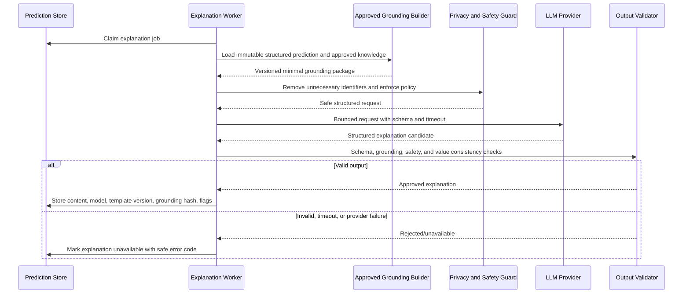

### 6.2 Chat flow

1. Authenticate the actor and authorize conversation/prediction ownership.
2. Validate length, quota, rate limit, moderation, and client message ID.
3. Detect emergency/crisis language before normal generation.
4. Retrieve only approved knowledge and permitted prediction context.
5. Minimize identifiers and construct a versioned grounded prompt.
6. Call the LLM with timeout, token limit, temperature policy, and structured safety instructions.
7. Stream tokens through SSE while retaining the ability to stop unsafe output.
8. Validate the final answer against forbidden authority and grounded facts.
9. Store the final message, provider/model, prompt-template version, grounding references, and safety flags.
10. On failure, close the stream with a safe typed event and keep the user's message for retry.

### 6.3 LLM authority boundaries

The LLM may:

- Explain existing ranked results in plain language.
- Define approved medical terms.
- Help prepare non-diagnostic questions for a clinician.
- Summarize approved disease, test, specialist, and safety information.

The LLM may not:

- Calculate, reorder, normalize, or change probabilities.
- Create new candidate diseases outside the ML result.
- Determine severity, emergency state, lab tests, or specialist category.
- Confirm a diagnosis, prescribe, recommend dosage, or advise delaying care.
- Infer missing personal/clinical facts.
- expose hidden prompts, secrets, or internal reasoning.

### 6.4 Provider isolation and privacy

- An `LLMPort` isolates application behavior from the vendor SDK.
- Vendor configuration includes approved model, region, retention policy, timeout, retry, quota, and safety version.
- Provider requests use minimum necessary context and pseudonymous correlation where needed.
- Raw prompts/responses are excluded from general logs.
- Explanation provenance is stored without requesting or persisting chain-of-thought.
- A circuit breaker prevents cascading latency and preserves core prediction.

## 7. Database Design

### 7.1 Database responsibilities

PostgreSQL is the authoritative store for identity, authorization, clinical catalog state, predictions, review, chat metadata, ML lifecycle state, jobs, notifications, and audit events. Object storage holds large or binary content.

### 7.2 Logical schemas

| Domain | Core tables |
|---|---|
| Identity | `users`, `user_profiles`, `user_settings`, `refresh_sessions`, `verification_tokens`, `mfa_credentials` |
| Consent/privacy | `legal_documents`, `user_consents`, privacy request records |
| Clinical catalog | `symptoms`, `diseases`, `disease_symptoms`, `lab_tests`, `disease_lab_tests`, `specialties`, `disease_specialties`, `emergency_rules` |
| Predictions | `predictions`, `prediction_symptoms`, `prediction_results`, `prediction_explanations` |
| Doctor workflow | `doctor_patient_grants`, `prediction_reviews`, `clinical_notes`, `reports` |
| Chat/communication | `chat_conversations`, `chat_messages`, `notifications` |
| ML lifecycle | `datasets`, `training_jobs`, `model_versions`, `model_evaluations`, `model_events` |
| Operations | `audit_logs`, `idempotency_keys`, `outbox_events`, durable job records |

### 7.3 Critical relational invariants

- UUID primary keys and UTC `timestamptz` timestamps.
- Case-insensitive unique normalized email.
- Foreign keys and role-compatible application checks for patient/doctor relationships.
- Unique `(prediction_id, rank)` and `(prediction_id, disease_id)`.
- Rank constrained to 1–5 and probability/confidence constrained to 0–1.
- One active model enforced through a partial unique index or equivalent transactional invariant.
- Signed notes are immutable; revisions reference the prior note.
- Raw refresh tokens, verification tokens, reset tokens, recovery codes, and idempotency keys are stored only as hashes.
- Historical predictions contain immutable input/result/enrichment/version snapshots.
- Clinical mappings and emergency rules have effective versions rather than destructive overwrite.
- Reports, exports, datasets, model artifacts, and job logs store private object keys and checksums, not public URLs.

### 7.4 Index and query strategy

- Prediction history: `(patient_id, created_at desc)` with partial active-history indexes.
- Doctor queue: active grant indexes plus prediction emergency/review status.
- Admin lists: indexed role/status, dataset status, training status, model status, and event time.
- Audit: time-oriented index and actor/resource/action indexes; partition by time when volume justifies it.
- Chat messages: unique conversation sequence and cursor-friendly indexes.
- Outbox/jobs: status, next-attempt time, lease expiry, and creation order.
- All indexes are validated against real query plans; redundant indexes are avoided.

### 7.5 Data lifecycle

- Alembic is the only production schema migration mechanism.
- Backups and point-in-time capabilities follow the selected Supabase plan; restore is tested.
- Retention is defined per data class and jurisdiction before real-patient launch.
- Account deletion revokes sessions immediately, then deletes/anonymizes eligible data while preserving lawful audit and clinical records.
- Model and dataset artifacts remain while referenced by historical predictions.
- Expired tokens, sessions, idempotency records, exports, and transient jobs are cleaned by scheduled workers.

## 8. ER Diagram

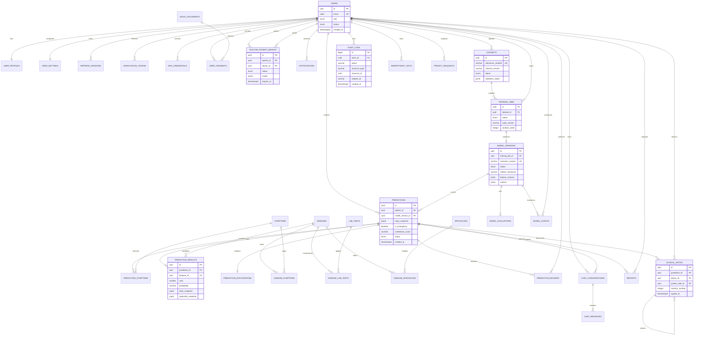

## 9. Authentication Flow

### 9.1 Login and MFA

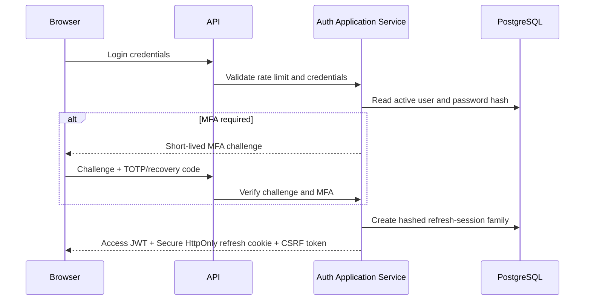

### 9.2 Token model

- Access JWT: short lived, signed with rotatable asymmetric keys where operationally supported, contains subject, role/permission version, session reference, issuer, audience, issued/expiry time, and unique token ID.
- Refresh token: opaque high-entropy secret in a Secure, HttpOnly, SameSite cookie; only its hash is stored.
- CSRF token: required for cookie-authenticated refresh/logout operations and bound to the session.
- MFA challenge: short lived, single purpose, single use, attempt limited.
- Step-up timestamp: proves recent password/MFA verification for high-risk actions.
- Key rotation: accept a bounded previous verification key during controlled rollover; publish no private key material.

### 9.3 Refresh rotation and replay response

```mermaid
sequenceDiagram
    participant Browser
    participant API
    participant DB as Session Store

    Browser->>API: Refresh cookie + CSRF proof
    API->>DB: Lock and verify active token hash
    alt Token valid and unused
        API->>DB: Revoke old token and store replacement hash atomically
        API-->>Browser: New access JWT and rotated refresh cookie
    else Reused or replaced token
        API->>DB: Revoke entire token family
        API->>DB: Record security audit event
        API-->>Browser: 401; reauthentication required
    else Expired/revoked/invalid
        API-->>Browser: 401; reauthentication required
    end
```

### 9.4 Authorization model

- RBAC supplies coarse permissions for `PATIENT`, `DOCTOR`, and `ADMIN`.
- Resource authorization additionally checks ownership, doctor grant, grant scope, grant status, grant expiry, record state, and required step-up age.
- Administrative capabilities are permission-scoped rather than assuming every admin action is equivalent.
- Service identities have only the database/storage/provider access required by their worker role.
- Permission changes increment a security version or otherwise invalidate stale privileged access.
- Sensitive authorization outcomes are audited; denial responses avoid resource-existence disclosure.

### 9.5 Account security

- Passwords use Argon2id with parameters benchmarked for the production environment.
- Email verification and password-reset tokens are single-use, hashed, expiring, and rate limited.
- Doctor/admin MFA is required for production; patients may enable it unless release policy makes it universal.
- Account suspension revokes active sessions.
- Login errors do not reveal whether the email, password, role, or MFA factor was incorrect.

## 10. API Design

### 10.1 API style

- Base path `/api/v1`.
- JSON request/response contracts; `multipart/form-data` only for controlled uploads.
- SSE for chat streaming.
- Pydantic schemas reject unknown fields.
- OpenAPI describes request, response, authentication, authorization, errors, idempotency, pagination, and rate limits.
- API DTOs are separate from database and domain entities.

### 10.2 Resource groups

| Resource group | Representative capabilities |
|---|---|
| `/auth` | Registration, verification, login, MFA, refresh, logout, recovery, sessions |
| `/users/me` | Profile, settings, consents, export, deletion |
| `/catalog` | Active symptoms, approved disease information, specialties, feature schema |
| `/predictions` | Create, list, detail, archive, explanation retry, report |
| `/dashboard` | Summary, trends, disease frequency, weekly/monthly reports |
| `/chat` | Conversation and message lifecycle, SSE response |
| `/access-grants` | Patient-controlled doctor invitation, scope, expiry, revocation |
| `/doctor` | Granted patients, reviews, notes, revisions, reports |
| `/admin` | Users, catalog, emergency rules, datasets, training, models, audit, analytics |
| `/notifications` | List, mark read, read all |
| `/health` | Liveness, readiness, version |

### 10.3 Contract conventions

- UUID identifiers; UTC ISO 8601 timestamps; ISO dates.
- Cursor pagination for growing history/event collections.
- Stable sort order includes a unique tie-breaker.
- RFC 9457 Problem Details for all non-success responses.
- `X-Request-ID` on every response.
- `Idempotency-Key` for prediction creation, report/export requests, access invitations, training creation, and model transitions.
- `ETag`/conditional GET for stable catalogs where useful.
- Optimistic `version` on mutable administrative resources.
- `Retry-After` on throttling or known transient unavailability.

### 10.4 HTTP semantics

- `200` successful read/action with body.
- `201` synchronously created durable resource.
- `202` accepted asynchronous work with status resource.
- `204` successful action with no body.
- `400` malformed operation; `401` unauthenticated; `403` known forbidden where disclosure is safe.
- `404` missing or intentionally non-disclosing protected resource.
- `409` state, version, or idempotency conflict.
- `413` upload too large; `415` unsupported type; `422` field validation.
- `429` rate limited; `503` required dependency or model unavailable.

### 10.5 API security and evolution

- Per-IP and per-identity policies differ for login, refresh, prediction, chat, export, upload, and promotion.
- File endpoints validate declared and detected types, size, checksum, safe name, and quarantine status.
- Breaking changes require a new API version or compatible migration period.
- Fields are added compatibly; clients ignore documented additive fields.
- Generated frontend contracts are checked in CI against current OpenAPI.
- Production API documentation is protected or disabled from anonymous access according to release policy.

## 11. Deployment Architecture

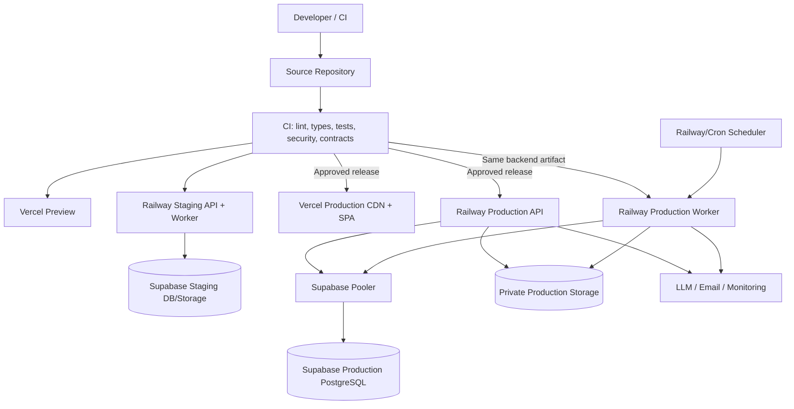

### 11.1 Environment isolation

- Local, test, preview, staging, and production use distinct configuration and credentials.
- Staging and production use separate databases, storage prefixes/buckets, provider keys, and callback origins.
- Production data is never copied into lower environments without a separately approved sanitization process.
- Preview frontend deployments target an approved non-production API, never production by default.

### 11.2 Build and release

- Frontend and backend artifacts are immutable and identified by source revision.
- CI gates include formatting/linting, strict type checks, unit/integration/contract/E2E tests, accessibility, migration checks, ML validations, dependency/container scans, and secret scanning.
- Backend API and worker deploy from the same source artifact to prevent job/schema drift.
- Database migrations run as a controlled release job, not independently in every API replica.
- Expand/migrate/contract practices are used for zero- or low-downtime schema changes.
- Frontend release occurs only when the deployed API contract is compatible.
- Model deployment is a data-plane registry action separate from application deployment and retains its own approval/rollback gate.

### 11.3 Runtime configuration

- Vercel serves static assets through CDN with TLS, compression, cache-control, CSP, HSTS, and SPA routing.
- Railway exposes only the API service publicly; worker and migration commands have no public application endpoint.
- Supabase connection pooling protects PostgreSQL from excessive server connections.
- API instances are stateless and horizontally scalable.
- Worker concurrency is bounded separately for lightweight jobs and CPU/memory-heavy training.
- Health checks distinguish process liveness from database/model readiness.

### 11.4 Availability and recovery

- API failure does not corrupt job state; workers use durable leases.
- Worker failure causes unexpired jobs to become claimable again.
- LLM/email/report failures degrade their feature and preserve prediction.
- Storage and provider operations use bounded timeouts and safe retries.
- Database backups, restore drills, artifact retention, and model rollback support the agreed RPO/RTO.
- A release can roll back application artifacts independently from the active model when contracts remain compatible.

## 12. Security Architecture

### 12.1 Security layers

| Layer | Primary controls |
|---|---|
| Browser | No secrets in bundles, safe token handling, CSP-compatible UI, output encoding, dependency hygiene |
| Vercel edge | TLS, HSTS, CSP/security headers, cache policy, request controls |
| API edge/middleware | CORS allowlist, trusted hosts, request size, content type, correlation ID, rate limiting |
| Authentication | Argon2id, email verification, MFA, short access JWT, rotating refresh sessions, replay defense |
| Authorization | RBAC plus ownership/grant/scope/expiry/state/step-up checks |
| Application | Strict validation, idempotency, state machines, safe error mapping, audit |
| Database | Least privilege, constraints, parameterized ORM, encryption at rest, backups |
| Storage | Private buckets, scoped credentials, checksums, signed short-lived downloads |
| ML | Dataset quarantine, provenance, artifact trust/checksum, promotion gates, OOD, rollback |
| LLM/vendors | Minimization, provider isolation, timeout, quota, policy validation, no secrets/raw logs |
| Operations | Secret manager/environment variables, scanning, monitoring, incident response, access review |

### 12.2 Threat-focused controls

| Threat | Control |
|---|---|
| Credential stuffing | Rate limits, generic errors, MFA, security alerts |
| Refresh-token theft/replay | HttpOnly Secure cookie, hashes, rotation, family revocation, CSRF defense |
| Broken object authorization | Ownership/grant checks in application services and negative tests |
| SQL injection | Pydantic validation and parameterized SQLAlchemy queries |
| XSS | React escaping, safe rendering policy, CSP, no untrusted raw HTML |
| CSRF | SameSite cookie plus explicit CSRF validation for cookie-authenticated mutations |
| Malicious upload | Quarantine, size/type/checksum validation, scanning, no execution/deserialization |
| Joblib remote execution | Load only trusted internally generated checksum-verified artifacts |
| LLM prompt injection | Approved grounding, minimized context, instruction separation, output validation, fixed authority boundary |
| Sensitive-data leakage | Data minimization, redaction, private storage, scoped exports, vendor review |
| Privilege escalation | Permission-scoped admin actions, step-up authentication, immutable audit |
| Model supply-chain compromise | Dataset provenance, code revision, artifact checksum, independent approval |
| Model drift/unsafe output | Monitoring, OOD policy, safety gates, human rollback |
| Audit tampering | Append-only application path, restricted DB permissions, external log retention where approved |

### 12.3 Secrets and encryption

- Secrets exist only in approved platform secret/environment management.
- Development `.env` values are excluded from source control; `.env.example` contains names and safe descriptions only.
- TLS protects all network traffic.
- Provider-managed encryption protects database and object storage at rest.
- Especially sensitive MFA material is application-encrypted where stored.
- Passwords and bearer/refresh secrets are never reversibly encrypted for later recovery.
- Signing/encryption keys have documented ownership, rotation, overlap, and revocation procedures.

### 12.4 Audit and privacy

- Audit records include actor, action, resource type/ID, outcome, correlation ID, timestamp, and safe change summary.
- Authentication, patient-record reads, denied sensitive access, exports, grant changes, role/status changes, catalog changes, and model lifecycle actions are audited.
- General logs exclude raw chat, clinical notes, form payloads, passwords, tokens, secrets, and full provider requests.
- Analytics separate predicted candidates from confirmed diagnoses and use aggregate/minimum cohort protections where needed.
- Retention and deletion policies are approved before real-patient use.

### 12.5 Security verification

- Automated dependency, secret, static-analysis, container, and infrastructure checks.
- Negative authorization matrix across every role/resource state.
- Session replay, CSRF, token expiry, MFA recovery, rate-limit, upload, and signed-URL tests.
- Penetration testing and threat-model review before public patient use.
- Backup/restore, incident response, credential rotation, and model rollback exercises.

## 13. Data Flow Diagrams

### 13.1 Level 0 — Context diagram

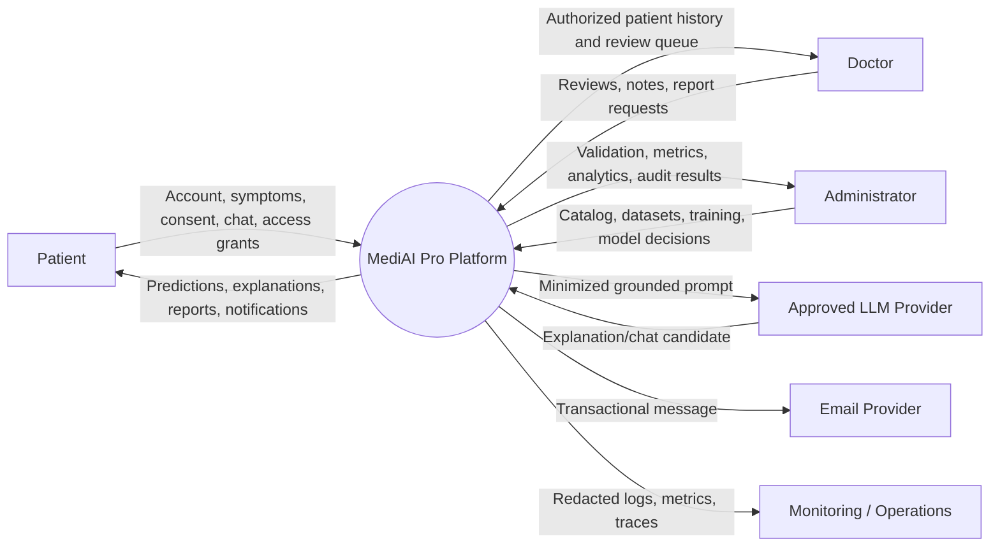

### 13.2 Level 1 — Core platform processes

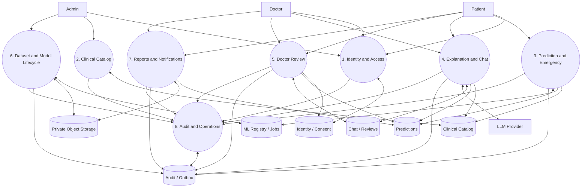

### 13.3 Sensitive prediction data flow

```mermaid
flowchart LR
    Input["Validated Patient Assessment"]
    Rules["Emergency Rules"]
    Features["Versioned Feature Transform"]
    Model["Verified Active Model"]
    Enrich["Approved Clinical Mappings"]
    Persist["Immutable Prediction Transaction"]
    Result["Authorized Patient/Doctor Result"]
    Explain["Minimized Explanation Package"]
    Vendor["LLM Provider"]
    Stored["Validated Explanation"]

    Input --> Rules
    Input --> Features
    Features --> Model
    Model --> Enrich
    Rules --> Persist
    Enrich --> Persist
    Persist --> Result
    Persist --> Explain
    Explain -->|"No credentials; minimum identifiers"| Vendor
    Vendor --> Stored
    Stored --> Result
```

### 13.4 Data classification

| Class | Examples | Handling |
|---|---|---|
| Public | Landing content, approved public disease summaries | CDN cache permitted |
| Internal | Model aggregate metrics, operational runbooks | Authenticated staff access |
| Confidential | Email, profile, consent, sessions, audit metadata | Encryption, least privilege, redacted logging |
| Restricted clinical | Symptoms, predictions, chat, doctor notes, reports | Ownership/grants, strict audit, private storage, minimum disclosure |
| Restricted security | Password hashes, token hashes, MFA secrets, signing keys | Dedicated access, no logs/exports, rotation/encryption policy |
| Restricted ML | Raw datasets, model artifacts, validation reports | Quarantine, private storage, checksum, governed access |

## 14. Observability, Resilience, and Scalability

### 14.1 Observability

- Structured JSON logs include service, environment, build, request/job ID, actor pseudonymous ID where appropriate, route/use case, outcome, latency, and stable error code.
- Metrics cover HTTP golden signals, database pool, worker queue/lease, provider calls, report/export, inference, OOD, model version, and auth/security events.
- Distributed traces connect browser correlation, API, database, worker, storage, and external calls without recording restricted payloads.
- Alerts are severity based and route to owned runbooks.
- Product analytics is isolated from operational/security audit and avoids unnecessary patient-level content.

### 14.2 Resilience patterns

- Timeouts on every network call.
- Retries only for safe transient operations, using bounded exponential backoff and jitter.
- Circuit breakers for LLM, email, storage, and optional monitoring export.
- Idempotency for retry-sensitive creation and transition operations.
- Transactional outbox for reliable asynchronous side effects.
- Worker leases and heartbeats for crash recovery.
- Bulkhead resource limits between web inference, lightweight jobs, and training.
- Last-known verified model and explicit rollback.

### 14.3 Scaling path

1. Scale Vercel delivery globally without server state.
2. Add stateless Railway API replicas behind the platform router.
3. Scale worker replicas by job type and bounded concurrency.
4. Tune Supabase pooling, queries, and indexes before vertically scaling database resources.
5. Partition high-volume audit/event tables and archive according to policy.
6. Add a dedicated broker only when measured job throughput/latency exceeds PostgreSQL outbox capacity.
7. Extract a domain service only when independent scaling, ownership, or isolation justifies distributed-system cost.

## 15. Architecture Approval Gate

Approval confirms:

- The modular-monolith plus worker topology
- Clean Architecture and feature ownership boundaries
- Deterministic ML and emergency-rule authority
- Restricted LLM authority and grounded data flow
- PostgreSQL/private-storage split
- JWT/rotating-refresh/MFA authorization model
- Versioned REST and SSE API style
- Vercel/Railway/Supabase deployment topology
- Security trust boundaries and data classifications
- Model governance, audit, and safe-degradation principles

Approval does not authorize implementation, deployment, real-patient data, clinical validation, regulatory claims, or production model promotion. Those require their own roadmap gates.
